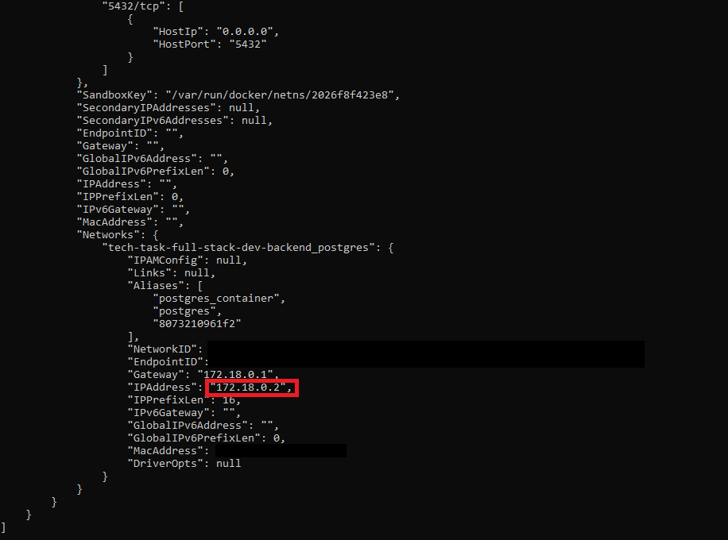
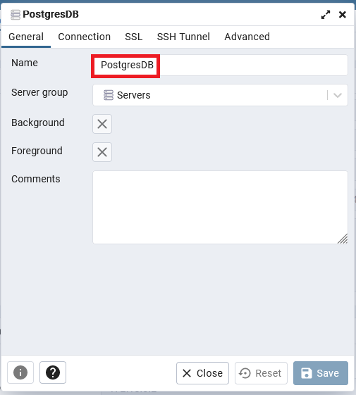
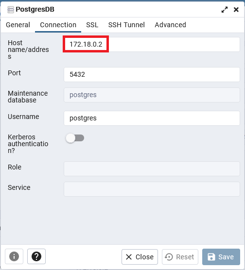

### Initial Database SetUp

First time you run 
```
docker-compose up
```

only the database ***db*** was created. Next step is to create the necessary tables. For creating the Tables we use ***pdAdmin*** by running the SQL-Queries from file ***create.sql***.

#### Create file ***create.sql***

To generate ***create.sql*** run:

```
gradlew clean build
```

IMPORTANT: To execute with ***pgAdmin*** the SQL-Queries from ***create.sql*** you have to append to every SQL-Query an ***semicolon***.

#### Setup pgAdmin

To access ***pgAdmin*** invoke: [http://localhost:5050/browser/](http://localhost:5050/browser/)

##### pgAdmin Database Connection

To setup a connection with pgAdmin to the postgresDB you need the ip-address from the running postgres docker instance.

1. Grap container-ID from postgres docker instance:
```
docker ps

CONTAINER ID   IMAGE            COMMAND                  CREATED        STATUS         PORTS                           NAMES
79ab86583b10   dpage/pgadmin4   "/entrypoint.sh"         20 hours ago   Up 5 seconds   443/tcp, 0.0.0.0:5050->80/tcp   pgadmin_container
8073210961f2   postgres         "docker-entrypoint.s…"   20 hours ago   Up 7 seconds   0.0.0.0:5432->5432/tcp          postgres_container
```

##### To get the **ip-address** of postgres docker container instance,  run:

```
docker inspect 8073210961f2
```



 Use **ip-address** from the console output for pgAdmin Connection





